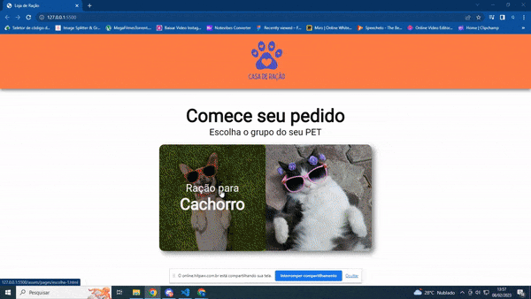

<h1>EM CONSTRUÇÃO...</h1>

<h2>Loja de Ração</h2>

Este projeto é uma loja virtual de ração para animais. A página inicial contém duas seções, uma para ração de cachorro e outra para ração de gato, 
cada uma com um link que direciona o usuário para uma segunda página com mais informações sobre o produto escolhido. O código HTML links para folhas de estilo CSS e fontes externas. O conteúdo é estruturado usando elementos HTML como header, main, section e links, que são estilizados através do CSS. Contem dois arquivos JavaScript, um deles é uma implementação de busca em tempo real, usado para buscar itens na loja pelo nome, e o outro é uma implementação do plugin de slider SwiperJS, usado para apresentar a frente e verso do item.

<h2> Instruções para uso: </h2>

1. Clone este repositório.  
2. Abra o arquivo `index.html` em um navegador web.

<h2>Tecnologias usadas</h2>

- HTML 
- CSS 
- JavaScript

<h2>Referências</h2>

- [Google Fonts](https://fonts.google.com/) 
- [SwiperJS] (https://swiperjs.com/)

<h3>GIF de apresentação do projeto:</h3>

Obs: Logo tera a versão responsiva da pagina de compra.

